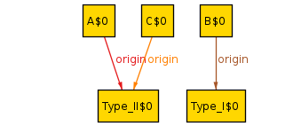
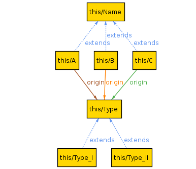

# AlloyTools-101

Alloy is a declarative language for describing and analyzing complex systems. It is based on first-order logic and was developed at Carnegie Mellon University by Daniel Jackson.<br/>
<br/>
**How Alloy tools helps software development?** <br/>
In industry, Alloy is often used in software engineering and formal methods to support the development of reliable and secure software systems. It can be used to model and analyze systems at a high level of abstraction, helping developers to understand the behavior and properties of their systems and to identify potential issues early in the development process. Some specific ways in which Alloy is used in industry include:<br/>
<br/>
1- Specification and design: Alloy can be used to specify the desired behavior and properties of a software system, helping developers to understand the requirements of the system and to design a solution that meets these requirements.

2- Model-based testing: Alloy can be used to generate test cases for a software system based on a model of the system's behavior. This can help developers to validate the correctness of their code and to ensure that it behaves as intended.

3- Formal verification: Alloy can be used to formally verify the correctness of a software system, helping developers to ensure that it meets its specifications and behaves correctly in all possible scenarios.

4- Risk assessment: Alloy can be used to model and analyze the risk profile of a software system, helping developers to understand the potential impact of failures and to identify potential vulnerabilities.

---

**How to Learn it:**

Overall, Alloy is a powerful tool for supporting the development of reliable and secure software systems in industry. To learn Alloy, you may find the following resources helpful:

1. Web pages related to the Alloy provides an overview of the language and links to some **documentation** and **tutorials**:

- [alloytools.org](https://alloytools.org/documentation.html)
- [csail.mit.edu](https://www.csail.mit.edu/research/alloy)
- A report on Alloy: [[pdf]](https://www.doc.ic.ac.uk/project/examples/2007/271j/suprema_on_alloy/Final%20Report/LaTeX/report.pdf)

2. The Alloy Analyzer is a tool that can be used to model and analyze systems using Alloy. It includes a **built-in tutorial** and **examples** that can help you get started with the language.

3. There are also several online tutorials and courses available that provide more in-depth explanations of the language and its capabilities.
- Youtube: [@michasitko1041](https://www.youtube.com/@michasitko1041)

4. The Alloy book, **"Software Abstractions: Logic, Language, and Analysis"** by Daniel Jackson, provides a comprehensive introduction to the language and its applications.

-  book: [[pdf]](https://www.cin.ufpe.br/~if721/intranet/AlloyBook.pdf)

5. Finally, you may find it helpful to work on some practice problems and exercises to solidify your understanding of the language. There are many resources available online that provide sample Alloy code and problems for you to solve.

---

**1- Installation:**

1. Check if you have Java ```java -version``` (get one if none shown)
2. Download the latest version of alloy from [GitHub > AlloyTools](https://github.com/AlloyTools/org.alloytools.alloy/releases).
3. Run the file ``` java -jar file_name.jar ```
---

**2- Getting Started:**<br/>

**I) Signatures:**<br/>

-**sig block_name {}** To model our system we use blocks & arrows as respectively signatures & relations. <br/>
-**abstract sig block_name {}** is used to define a block with defined extensions or elements. <br/>
-**sig B extends A {}** this command will define elements (B is elements of A). <br/>
-**one / lone / some** is used to define number of possible blocks in our system. For example: **one sig B,C extends A {}**<br/>
these commands mean: one = {1} / lone = {0 or 1} / some = { 1 or above }


**II) Relations:**<br/>
-Any extension automatically makes an arrows to show the relation between a block and it's subsets <br/>
-To create a relation we can define an arrow from a domain element (A) to a range element (B) by: **sig A{arrow_name: possible_num B}** <br/>
-**possible_num** will be defined by: **one / lone / some / set** <br/><br/>
these commands mean: one = {1} / lone = {0 or 1} / some = { 1 or above } / set = { 0 or above } 

**III) Run and show:**<br/>

Add following two lines to and use **crtl+E** run & show the model: <br/>

    pred show() {}
    run show

- in case you need to look at the whole model and not just an Instance or example, use **crtl+M** to view the Metamodel <br/>


**Example code:**


    abstract sig Type{}
    abstract sig Name{}
    sig Type_I , Type_II extends Type {}
    one sig A, B, C extends Name { origin: one Type}

    pred show() {}
    run show

<br/>
Here is of an instance of the code above: <br/><br/>



<br/><br/><br/>
And this is the Metamodel: <br/><br/>


<br/><br/><br/>
 ---

**3- Operators:**<br/>

**I-Set operators:** 
- union **+**
- intersection **&**
- difference **-**
- subset **in**
- equality **=**

**II-Relational operators:**
- product/arrow **->**
- dot
- box
- transpose
- transitive closure
- reflective transitive closure
- domain restriction
- range restriction
- override


